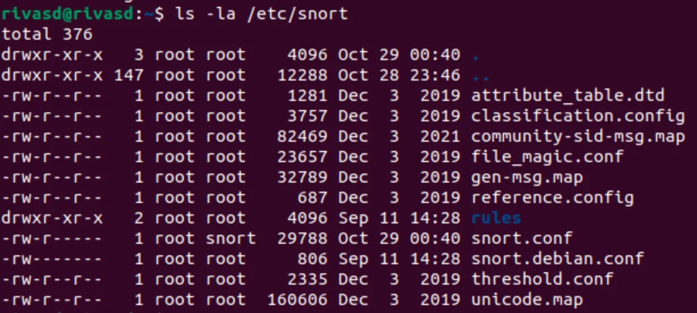

# Snort IPS

**I. Update the System**

Ensure the Ubuntu environment is up to date before installing Snort.

```sh
sudo apt update
sudo apt upgrade -y
```

**II. Install Snort**

Snort can be installed directly using `apt`.

```sh
sudo apt install snort -y
```


Snort is installed to the `/etc/snort` directory.



We first need to determine the network interface we want Snort to monitor.

```sh
ip a
```

**III. Configure Snort**

We can configure Snort using the `snort.conf` configuration file.

```sh
sudo nano /etc/snort/snort.conf
```


Then we can monitor the `ens160` network interface.


**IV. Update and Manage Snort Rules**

Snort comes pre-installed with rules by default. We can download community rules which can enhance threat detection.

```sh
sudo wget https://www.snort.org/downloads/community/community-rules.tar.gz
sudo tar -xvzf community-rules.tar.gz
sudo cp community-rules/* /etc/snort/rules/
```

Additionally, we can add our own rules by manually editing the local rule file.

```sh
sudo nano /etc/snort/rules/local.rules
```


In the example above, a rule was added to detect ICMP (Ping) traffic.

There should now be various rule files in the `/etc/snort/rules/` directory.


Some notable rule files are:
- `ddos.rules`: Denial of service attacks
- `exploit.rules`: Known exploits and vulnerabilities
- `scan.rules`: Port scans and network reconnaissance

**V. Test Snort Configuration**

Now that Snort is configured, we can run a configuration test.

```sh
sudo snort -T -c /etc/snort/snort.conf
```


**VI. Running Snort in IDS Mode**

We can then run Snort in IDS mode to monitor traffic on `ens160`. To exit, use `^C`.

```sh
sudo snort -c /etc/snort/snort.conf -i eth0
```


**VII. Viewing Snort Logs**

Snort log alerts are found in the `/var/log/snort/` directory.


**VIII. Running Snort as a Daemon**

The following command will run Snort in the background as a daemon, monitoring `ens160`.

We can verify what processes are currently running in the `top` command.


The Snort process can be killed by executing the following:

```sh
sudo killall snort
```
